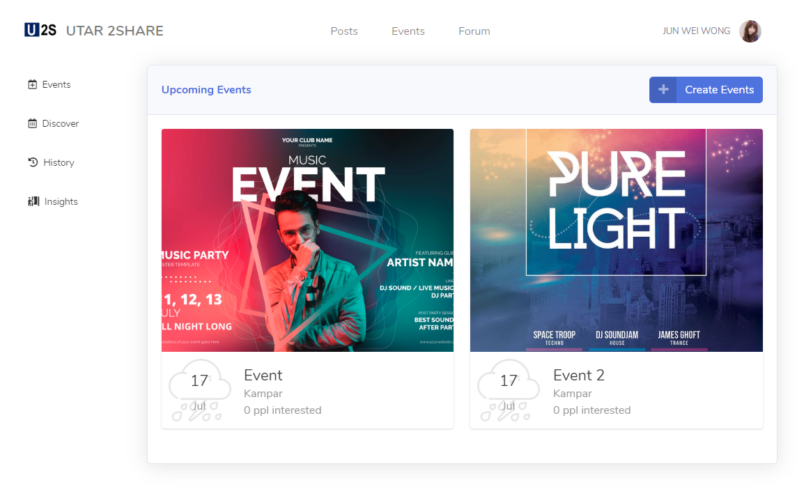
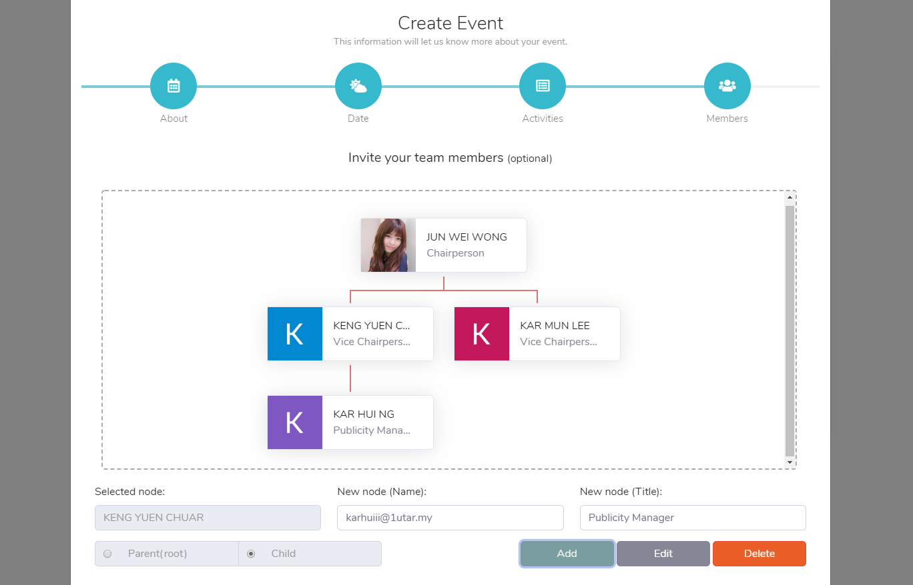

# Web_Event_Management_System
UCCD2513 Mini Project

Develop an online event management system that includes features that enables students to effectively on event planning, preparation and analyzing event participants. (HTML, CSS, Bootstrap, Javascript, JQuery, Firebase DB)

Demo Link : https://miniproject-ca058.web.app/
